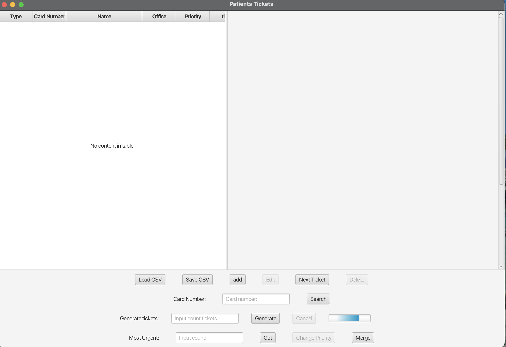
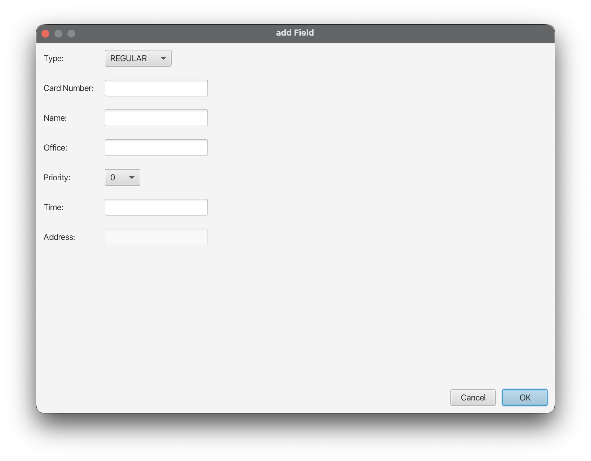
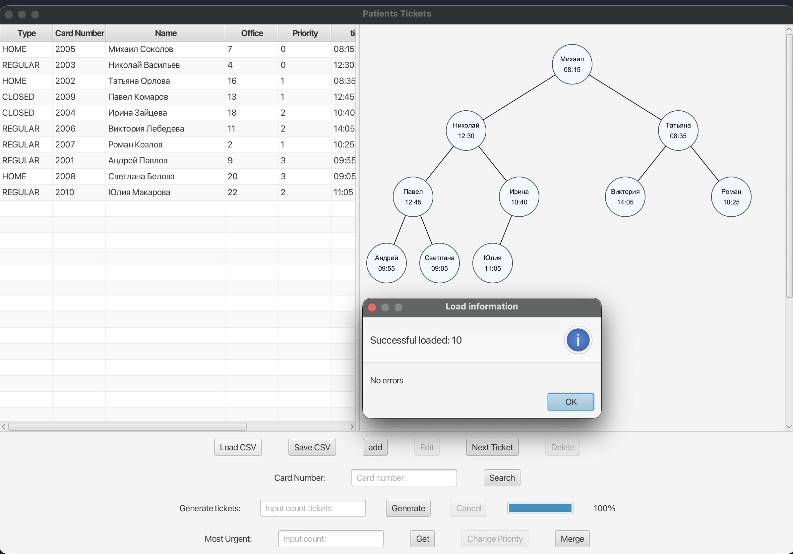
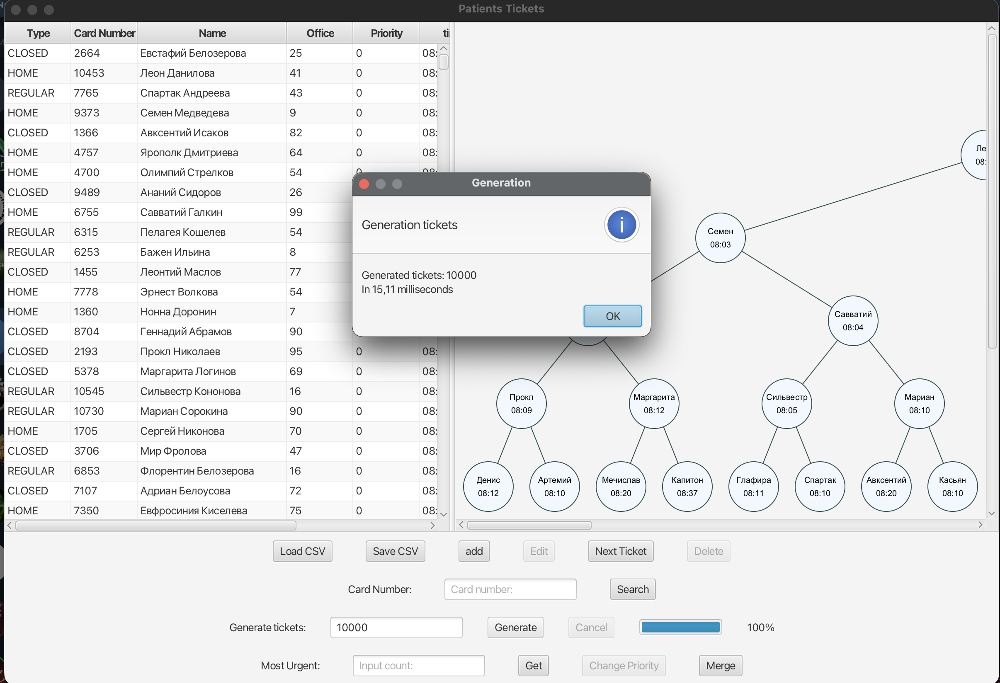
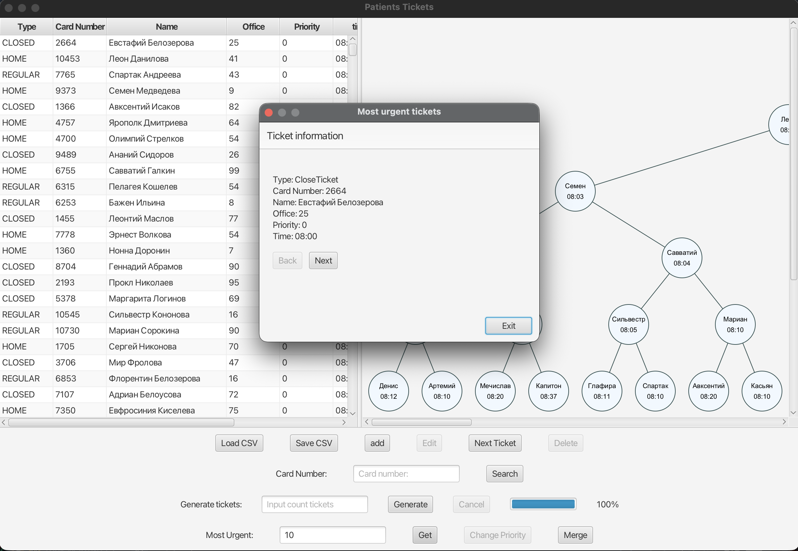

# Clinic Queue Java

Учебный проект на Java, реализующий электронную очередь поликлиники.

Лабораторная работа №2 по дисциплине «Программирование на Java». Вариант №6.

Основная задача — реализация очереди с приоритетами на основе собственной бинарной min-heap (минимальной кучи) с графическим интерфейсом JavaFX.

## Возможности

- Добавление, удаление, поиск и редактирование талонов
- Обслуживание следующего пациента с учётом приоритета
- Изменение приоритета талона
- Получение K наиболее срочных талонов
- Объединение двух очередей
- Загрузка и сохранение данных в CSV
- Генерация случайных талонов
- Визуализация бинарной кучи с подсветкой посещённых вершин
- Фоновая загрузка, сохранение и генерация данных с отображением прогресса

## Типы талонов

В программе используются три типа талонов:

- `REGULAR` — обычный талон
- `HOME` — вызов на дом с указанием адреса
- `CLOSED` — закрытый талон, недоступный для редактирования

Каждый талон содержит номер карты, ФИО пациента, номер кабинета, приоритет и время

Приоритет принимает значения от 0 до 3, где 0 — наиболее срочный. Если приоритеты совпадают, первым обслуживается пациент с более ранним временем

## Структура данных

Для хранения талонов реализован собственный обобщённый класс `BinHeap<T>`

Куча построена на массиве. При добавлении и удалении элементов используются операции `siftUp` и `siftDown`

Основные операции:
- Добавление элемента 
- Извлечение минимального элемента 
- Поиск элемента 
- Удаление элемента по значению 
- Изменение позиции элемента по индексу 


## Демонстрация работы

### Главное окно

Таблица талонов и визуализация бинарной кучи



### Добавление талона

При добавлении нового талона можно выбрать его тип, указать данные пациента, кабинет, приоритет и время приёма. Для талона HOME дополнительно указывается адрес



### Загрузка из CSV

После загрузки отображается количество успешно прочитанных талонов и информация об ошибках(сохраняется в отдельном файле)


-Загрузка выполняется в фоном режиме с помощью отдельного потока

### Генерация талонов

Программа позволяет генерировать заданное количество талонов. Генерация выполняется в отдельном потоке


-Генерация выполняется в фоном режиме с помощью отдельного потока

### Наиболее срочные талоны

Операция позволяет получить K наиболее срочных талонов без изменения исходной очереди



## Эксперименты и сравнение

В проекте также реализованы отдельные классы для проверки работы структуры данных:

- `HeapBenchmark` - измерение времени основных и дополнительных операций на 10 000 и 100 000 элементах
- `HeapComparison` — сравнение собственной кучи со стандартной `PriorityQueue`
- `HeapConcurrencyDemo` — демонстрация гонки потоков при одновременной записи и её устранения с помощью `synchronized`

Эксперименты находятся в пакете `lab2.experiment` 

## Технологии

- Java 25
- JavaFX 25
- Gradle
- CSV

## Запуск

Для запуска необходим установленный JDK 25.

Клонировать репозиторий:

```bash
git clone https://github.com/EgorKubakin/clinic-queue-java.git
```

Перейти в папку проекта:

```bash
cd clinic-queue-java
```

Запустить приложение:

```bash
./gradlew run
```

Для сборки проекта:

```bash
./gradlew build
```
